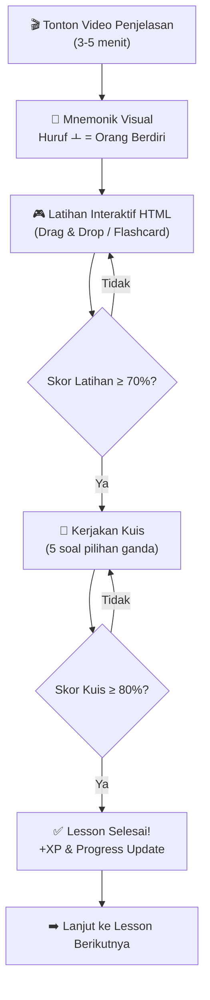

# 🇰🇷 Kurikulum Belajar Bahasa Korea Berbasis Mnemonik Interaktif

## Konsep Utama

**Mnemonik** adalah teknik menghafal menggunakan asosiasi visual, cerita, dan pola yang sudah familiar bagi otak. Untuk bahasa Korea, ini sangat efektif karena huruf Hangeul memiliki bentuk yang bisa diasosiasikan dengan objek sehari-hari, dan kosakata Korea bisa dihubungkan dengan bunyi kata Indonesia/Inggris.

---

## Pemetaan ke Sistem BelajarKorea.id

Kurikulum ini dirancang agar langsung bisa diimplementasikan ke dalam struktur database yang sudah ada:

| Komponen Kurikulum | Mapping di Aplikasi |
|---|---|
| **Chapter** | `courses` (1 chapter = 1 course) |
| **Lesson** | `lessons` (video penjelasan + HTML interaktif) |
| **Kuis Mnemonik** | `quiz_questions` (soal berbasis asosiasi) |
| **Materi Interaktif** | File HTML statis di `/public/interactive/` atau disajikan via `digital_products` |
| **Level** | Field `level` di `courses` (beginner, intermediate, advanced) |

---

## Struktur Kurikulum Lengkap

### 📘 LEVEL 1: BEGINNER (Chapter 1–6)

---

#### Chapter 1: Hangeul — Huruf Vokal Dasar (ㅏ ㅓ ㅗ ㅜ ㅡ ㅣ)

> **Tujuan:** Siswa mampu membaca dan menulis 6 huruf vokal dasar Korea.

| # | Judul Lesson | Tipe Konten | Teknik Mnemonik |
|---|---|---|---|
| 1.1 | Mengenal Hangeul: Kisah Asal-Usul | Video | Cerita Raja Sejong & filosofi alam |
| 1.2 | Vokal ㅏ (a) & ㅓ (eo) | Video + HTML | ㅏ = "tongkat dengan tangan kanan menunjuk ke kanan = **A**rah kanan". ㅓ = "tongkat menunjuk kiri = arah **E**rror (salah)" |
| 1.3 | Vokal ㅗ (o) & ㅜ (u) | Video + HTML | ㅗ = "garis ke atas = **O**rang berdiri". ㅜ = "garis ke bawah = **U**ntuk duduk" |
| 1.4 | Vokal ㅡ (eu) & ㅣ (i) | Video + HTML | ㅡ = "garis datar = mulut datar saat bilang 'eu'". ㅣ = "garis tegak = pohon = **I**tu pohon" |
| 1.5 | Latihan Interaktif: Tebak Vokal | HTML Interaktif | Drag & drop huruf ke gambar asosiasi |
| **Quiz** | Kuis Chapter 1 | 5 soal | Pilihan ganda + pencocokan suara |

**Contoh Soal Kuis Mnemonik:**
```
Huruf mana yang terlihat seperti "orang berdiri"?
A) ㅜ  B) ㅗ  C) ㅡ  D) ㅣ
Jawaban: B (ㅗ — garis ke atas = orang berdiri = "O")
```

---

#### Chapter 2: Hangeul — Huruf Konsonan Dasar (ㄱ ㄴ ㄷ ㄹ ㅁ ㅂ ㅅ ㅇ ㅈ)

> **Tujuan:** Siswa mampu membaca 9 konsonan dasar dan mulai menyusun suku kata.

| # | Judul Lesson | Tipe Konten | Teknik Mnemonik |
|---|---|---|---|
| 2.1 | Konsonan ㄱ (g) & ㄴ (n) | Video + HTML | ㄱ = bentuk **G**un (pistol). ㄴ = huruf **N** yang dibalik |
| 2.2 | Konsonan ㄷ (d) & ㄹ (r/l) | Video + HTML | ㄷ = **D**oor frame (kusen pintu). ㄹ = ular yang ber**L**iku-liku |
| 2.3 | Konsonan ㅁ (m) & ㅂ (b) | Video + HTML | ㅁ = **M**ap (peta kotak). ㅂ = **B**ucket (ember) |
| 2.4 | Konsonan ㅅ (s), ㅇ (ng/silent) & ㅈ (j) | Video + HTML | ㅅ = topi **S**anta. ㅇ = **O**-ring / angka nol. ㅈ = **J**ellyfish (ubur-ubur) |
| 2.5 | Latihan: Susun Suku Kata Pertamamu | HTML Interaktif | Klik konsonan + vokal → dengar bunyinya |
| **Quiz** | Kuis Chapter 2 | 5 soal | Cocokkan bentuk huruf dengan gambar mnemonik |

---

#### Chapter 3: Hangeul — Vokal Gabungan & Konsonan Ganda

> **Tujuan:** Menguasai sisa alfabet Hangeul (vokal gabungan + konsonan aspirasi/tegang).

| # | Judul Lesson | Tipe Konten | Teknik Mnemonik |
|---|---|---|---|
| 3.1 | Vokal Gabungan: ㅐ ㅔ ㅘ ㅝ ㅢ | Video + HTML | ㅐ = ㅏ+ㅣ "dua teman jadi satu suara **ae**". Animasi merge huruf |
| 3.2 | Konsonan Aspirasi: ㅋ ㅌ ㅍ ㅎ | Video + HTML | ㅋ = ㄱ + hembusan = **K**ick dengan tenaga. ㅌ = ㄷ + hembusan = **T**iger roar |
| 3.3 | Konsonan Tegang: ㄲ ㄸ ㅃ ㅆ ㅉ | Video + HTML | "Double power!" — animasi karakter menekan lebih keras |
| 3.4 | Batchim (Huruf di Bawah Suku Kata) | Video + HTML | Visualisasi "lantai rumah" — konsonan tidur di bawah |
| 3.5 | Master Challenge: Baca Nama Korea-mu! | HTML Interaktif | Input nama → transliterasi otomatis ke Hangeul |
| **Quiz** | Kuis Chapter 3 | 5 soal | Baca kata → pilih pelafalan yang benar (audio) |

---

#### Chapter 4: Kosakata Dasar — Salam & Perkenalan (인사 & 자기소개)

> **Tujuan:** Siswa bisa menyapa, memperkenalkan diri, dan menanyakan nama/umur.

| # | Judul Lesson | Tipe Konten | Teknik Mnemonik |
|---|---|---|---|
| 4.1 | 안녕하세요 & Salam Sehari-hari | Video + HTML | 안녕 = "**An**ak **Nyong**-nyong" (karakter lucu). Animasi membungkuk |
| 4.2 | 감사합니다 / 죄송합니다 | Video + HTML | 감사 = "**Gam**bar **Sa**yang" → terima kasih. 죄송 = "**Joe** **Song**ong" → maaf |
| 4.3 | 저는 ___입니다 (Saya adalah ___) | Video + HTML | Pola kalimat interaktif: isi nama → hasilkan kalimat Korea |
| 4.4 | Angka Korea (하나, 둘, 셋...) | Video + HTML | Mnemonik: 하나 = "**Ha**! **Na**h, satu!". Flash card animasi |
| 4.5 | Roleplay: Perkenalan di Kafe Korea | HTML Interaktif | Dialog interaktif pilihan ganda dengan suara |
| **Quiz** | Kuis Chapter 4 | 5 soal | Dengarkan audio → pilih respons yang tepat |

---

#### Chapter 5: Kosakata Dasar — Kehidupan Sehari-hari (일상생활)

> **Tujuan:** Menguasai 50+ kosakata sehari-hari menggunakan mnemonik visual.

| # | Judul Lesson | Tipe Konten | Teknik Mnemonik |
|---|---|---|---|
| 5.1 | Di Rumah: 방, 문, 창문, 의자... | Video + HTML | 방 (bang) = "**Bang**! Ledakan di kamar". Gambar ruangan interaktif |
| 5.2 | Makanan Korea: 밥, 물, 김치... | Video + HTML | 밥 (bap) = "**Bap**ak makan nasi". Menu restoran interaktif |
| 5.3 | Warna & Bentuk: 빨간, 파란... | Video + HTML | 빨간 (ppalgan) = "**Ppal**-ppal merah". Color picker game |
| 5.4 | Keluarga: 아버지, 어머니, 형... | Video + HTML | Pohon keluarga interaktif dengan karakter animasi |
| 5.5 | Memory Game: Kosakata Chapter 5 | HTML Interaktif | Kartu memori flip (gambar ↔ kata Korea) |
| **Quiz** | Kuis Chapter 5 | 5 soal | Gambar → pilih kosakata Korea yang benar |

---

#### Chapter 6: Tata Bahasa Dasar Level 1 (기초 문법)

> **Tujuan:** Memahami pola kalimat dasar Korea (S-O-V) dan partikel.

| # | Judul Lesson | Tipe Konten | Teknik Mnemonik |
|---|---|---|---|
| 6.1 | Pola Kalimat Korea: S + O + V | Video + HTML | "Korea itu terbalik!" — animasi susun kalimat (drag blocks) |
| 6.2 | Partikel 은/는 (topik) & 이/가 (subjek) | Video + HTML | 은/는 = "spotlight" 🔦 menyorot topik. 이/가 = "jari menunjuk" 👉 pelaku |
| 6.3 | Partikel 을/를 (objek) & 에 (tempat) | Video + HTML | 을/를 = "tangan menangkap" 🤲 objek. 에 = "pin lokasi" 📍 |
| 6.4 | Kata Kerja -아/어요 (Present Tense) | Video + HTML | Mesin konjugasi: masukkan kata dasar → keluar bentuk sopan |
| 6.5 | Membuat Kalimat Pertamamu | HTML Interaktif | Sentence builder: pilih subjek + objek + kata kerja → kalimat lengkap |
| **Quiz** | Kuis Chapter 6 | 5 soal | Susun kata acak menjadi kalimat Korea yang benar |

---

### 📗 LEVEL 2: INTERMEDIATE (Chapter 7–12)

---

#### Chapter 7: Percakapan di Tempat Umum (공공장소)

| # | Judul Lesson | Teknik Mnemonik |
|---|---|---|
| 7.1 | Di Restoran: Memesan Makanan | Simulasi menu + dialog |
| 7.2 | Di Toko: Bertanya Harga | "얼마예요?" = "**Eol**-**ma** (how **much**)?" |
| 7.3 | Di Stasiun: Membeli Tiket | Peta subway interaktif |
| 7.4 | Di Rumah Sakit: Menjelaskan Gejala | Body map interaktif — klik bagian tubuh |
| 7.5 | Roleplay Komprehensif | Branching dialogue game |

#### Chapter 8: Tata Bahasa Menengah 1 (문법 중급)

| # | Judul Lesson | Teknik Mnemonik |
|---|---|---|
| 8.1 | Past Tense: -았/었어요 | Timeline animasi: geser ke kiri = masa lalu |
| 8.2 | Future Tense: -ㄹ 거예요 | Timeline animasi: geser ke kanan = masa depan |
| 8.3 | Kata Penghubung: -고, -지만, -그래서 | "Lego connector blocks" — snap kalimat |
| 8.4 | Bentuk Formal vs Informal | Piramida kesopanan interaktif (3 level) |
| 8.5 | Latihan Komprehensif | Cerita pendek: isi bagian yang kosong |

#### Chapter 9: Kosakata Tematik — K-Drama & K-Pop (한류)

| # | Judul Lesson | Teknik Mnemonik |
|---|---|---|
| 9.1 | Ekspresi dari Drama Korea Populer | Clip adegan + subtitle interaktif |
| 9.2 | Lirik K-Pop: Belajar dari Lagu | Karaoke mode: highlight kata per kata |
| 9.3 | Slang Korea Modern | Meme & chat bubble simulator |
| 9.4 | Ekspresi Emosi (화나다, 슬프다...) | Emoji → kata Korea matching game |
| 9.5 | Tulis Pesan Fans ke Idol Favoritmu | Template surat interaktif |

#### Chapter 10: Membaca & Menulis (읽기 & 쓰기)

| # | Judul Lesson | Teknik Mnemonik |
|---|---|---|
| 10.1 | Membaca Tanda di Korea | Foto asli jalanan Seoul → tebak artinya |
| 10.2 | Membaca Menu Restoran Asli | Scan menu → highlight & terjemah |
| 10.3 | Menulis Diary Sederhana (일기) | Template diary + kosakata harian |
| 10.4 | Membaca Berita Anak Korea | Artikel pendek + kosakata highlighted |
| 10.5 | Challenge: Tulis 5 Kalimat Tentang Harimu | Writing prompt + AI review |

#### Chapter 11: Tata Bahasa Menengah 2 (문법 중급 심화)

| # | Judul Lesson | Teknik Mnemonik |
|---|---|---|
| 11.1 | Konditional: -(으)면 | "IF button" — tekan tombol = lihat hasil berbeda |
| 11.2 | Keinginan: -고 싶다 | Wishlist builder interaktif |
| 11.3 | Kemampuan: -(으)ㄹ 수 있다/없다 | Skill tree RPG: unlock kemampuan |
| 11.4 | Honorifik & Bahasa Sopan Tinggi | Role selector: bicara ke teman vs bos vs kakek |
| 11.5 | Latihan Komprehensif Grammar | Error detection: temukan kesalahan grammar |

#### Chapter 12: Proyek Akhir Level 2

| # | Judul Lesson | Teknik Mnemonik |
|---|---|---|
| 12.1 | Self-Introduction Speech (자기소개) | Template + rekam suara sendiri |
| 12.2 | Presentasi: Tempat Favoritku di Indonesia | Guided presentation builder |
| 12.3 | Dialog Panjang: Rencana Liburan | Multi-turn conversation builder |
| 12.4 | Ujian Komprehensif Level 2 | 20 soal campuran |
| 12.5 | Sertifikat & Evaluasi | Certificate generator + AI feedback |

---

### 📕 LEVEL 3: ADVANCED (Chapter 13–18)

---

#### Chapter 13: Kosakata Profesional & Akademik (전문 어휘)
- Kosakata bisnis, akademik, dan formal
- Mnemonik: Sino-Korean roots (한자 기반) — pelajari 1 akar kata = pahami 10+ kata turunan

#### Chapter 14: Tata Bahasa Lanjut (고급 문법)
- Passive/causative voice, reported speech, complex connectors
- Mnemonik: "Grammar transformer machine" — input kalimat sederhana → output kalimat kompleks

#### Chapter 15: Budaya & Etika Korea (한국 문화)
- Cara berperilaku di Korea, budaya kerja, hierarki sosial
- Simulasi situasi: pilih respons yang culturally appropriate

#### Chapter 16: Persiapan TOPIK I (한국어능력시험)
- Latihan soal mirip TOPIK resmi (듣기, 읽기)
- Timer-based practice test

#### Chapter 17: Persiapan TOPIK II (중고급)
- 쓰기 (menulis esai), 듣기 lanjut, 읽기 panjang
- AI-assisted essay grading

#### Chapter 18: Proyek Akhir & Sertifikasi
- Portfolio bahasa Korea: kumpulan karya tulis, rekaman bicara, hasil kuis
- Sertifikat kelulusan BelajarKorea.id

---

## Spesifikasi Teknis Implementasi HTML Interaktif

### Struktur File

```
public/interactive/
├── chapter-01/
│   ├── lesson-02-vokal-a-eo.html
│   ├── lesson-03-vokal-o-u.html
│   ├── lesson-05-tebak-vokal.html
│   └── assets/
│       ├── audio/
│       └── images/
├── chapter-02/
│   ├── lesson-05-susun-suku-kata.html
│   └── assets/
├── shared/
│   ├── mnemonic-engine.js      ← Library JS untuk flashcard, drag-drop, dll
│   ├── audio-player.js         ← Pemutaran audio pelafalan
│   ├── progress-tracker.js     ← Kirim progress ke API /api/progress
│   └── styles/
│       └── interactive.css     ← Styling konsisten
```

### Jenis Komponen HTML Interaktif

| Komponen | Deskripsi | Cocok Untuk |
|---|---|---|
| **Mnemonic Flashcard** | Kartu bolak-balik dengan gambar asosiasi + huruf Korea + audio | Hangeul, Kosakata |
| **Drag & Drop Matcher** | Seret huruf/kata ke gambar/arti yang sesuai | Hangeul, Partikel |
| **Syllable Builder** | Klik konsonan + vokal → suku kata terbentuk + suara | Chapter 2-3 |
| **Sentence Builder** | Susun blok kata menjadi kalimat (urutan S-O-V) | Grammar |
| **Dialogue Simulator** | Percakapan bercabang dengan pilihan respons | Percakapan |
| **Memory Card Game** | Buka 2 kartu yang cocok (gambar ↔ kata Korea) | Kosakata |
| **Audio Quiz** | Dengar pelafalan → pilih huruf/kata yang benar | Listening |
| **Writing Canvas** | Tulis huruf Hangeul dengan jari/mouse (stroke recognition) | Hangeul |
| **Name Translator** | Input nama Indonesia → output nama dalam Hangeul | Chapter 3 |
| **Interactive Scene** | Gambar situasi (restoran, stasiun) → klik objek → muncul kosakata | Kosakata tematik |

### Integrasi dengan Sistem Existing

```
┌─────────────────────────────────┐
│         Halaman Lesson          │
│  ┌───────────────────────────┐  │
│  │  📹 Video YouTube (atas)  │  │ ← Penjelasan konsep & mnemonik
│  └───────────────────────────┘  │
│  ┌───────────────────────────┐  │
│  │  🎮 HTML Interaktif       │  │ ← iframe ke /interactive/chapter-XX/
│  │  (di bawah video)         │  │    atau komponen React embedded
│  └───────────────────────────┘  │
│  ┌───────────────────────────┐  │
│  │  📝 Kuis (setelah selesai)│  │ ← Quiz modal yang sudah ada
│  └───────────────────────────┘  │
└─────────────────────────────────┘
```

### Opsi Penyimpanan Materi Interaktif

| Opsi | Pros | Cons |
|---|---|---|
| **A. File statis di `/public/interactive/`** | Mudah, cepat, bisa diakses offline (PWA cache) | Harus deploy ulang jika update konten |
| **B. Simpan HTML di Supabase Storage** | Admin bisa upload via panel tanpa deploy | Perlu fetch HTML, sedikit lebih lambat |
| **C. Komponen React di codebase** | Full kontrol, bisa pakai state React & API | Perlu developer untuk setiap perubahan konten |

> **Rekomendasi:** Gunakan **Opsi A** untuk awal (cepat diimplementasikan), lalu migrasi ke **Opsi B** setelah sistem admin konten diperkuat.

---

## Prioritas Implementasi

### 🏃 Phase 1 — MVP (2-3 minggu)
1. Chapter 1: Vokal Dasar (6 huruf) — 5 lesson + HTML interaktif
2. Chapter 2: Konsonan Dasar (9 huruf) — 5 lesson + HTML interaktif
3. Komponen: Mnemonic Flashcard + Syllable Builder

### 🚶 Phase 2 — Core Content (4-6 minggu)
4. Chapter 3-4: Sisa Hangeul + Salam & Perkenalan
5. Chapter 5-6: Kosakata Dasar + Grammar Dasar
6. Komponen: Memory Game + Sentence Builder + Dialogue Simulator

### 🏁 Phase 3 — Full Curriculum (8-12 minggu)
7. Chapter 7-12: Level Intermediate lengkap
8. Chapter 13-18: Level Advanced + TOPIK Prep
9. Komponen: Writing Canvas + Interactive Scene + AI Essay Review

---

## Contoh Alur Belajar Satu Lesson



---

> [!TIP]
> **Quick Win:** Mulai dari Chapter 1 & 2 (Hangeul) karena ini adalah kebutuhan paling fundamental setiap pelajar Korea dan paling cocok dengan teknik mnemonik visual. Jika 2 chapter ini berhasil, siswa akan terpikat dan berlangganan untuk konten selanjutnya!
